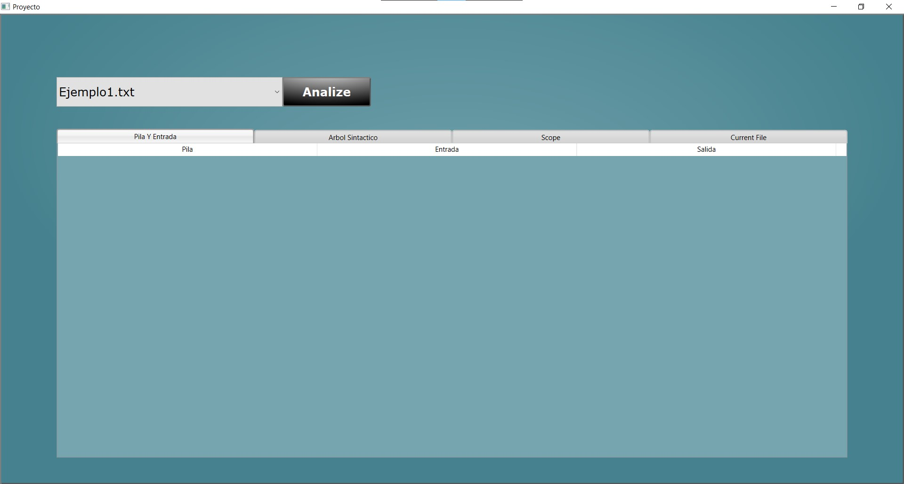
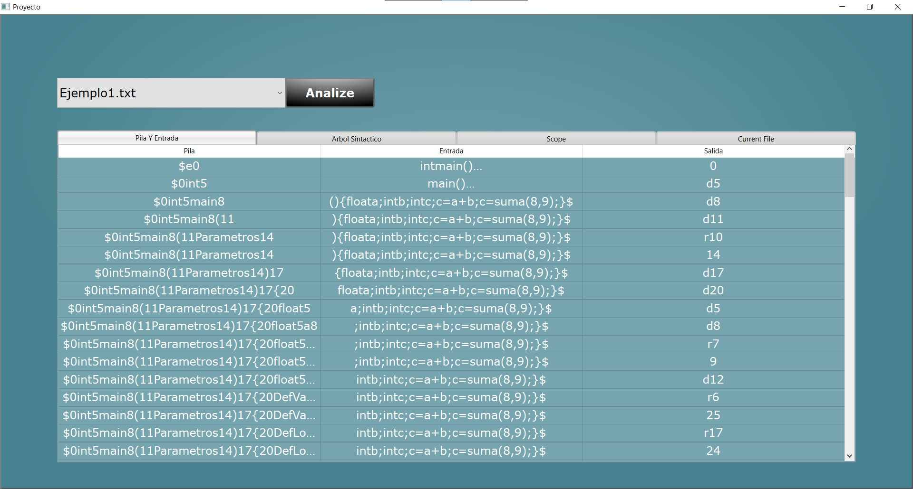
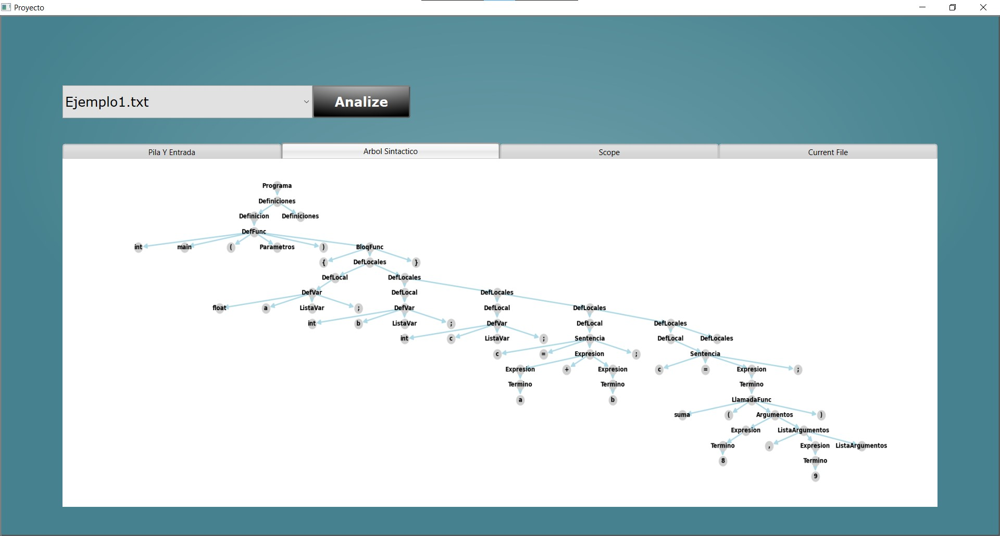
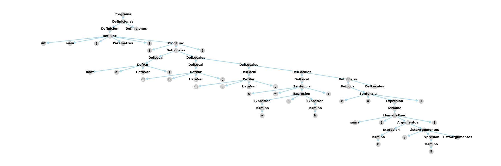
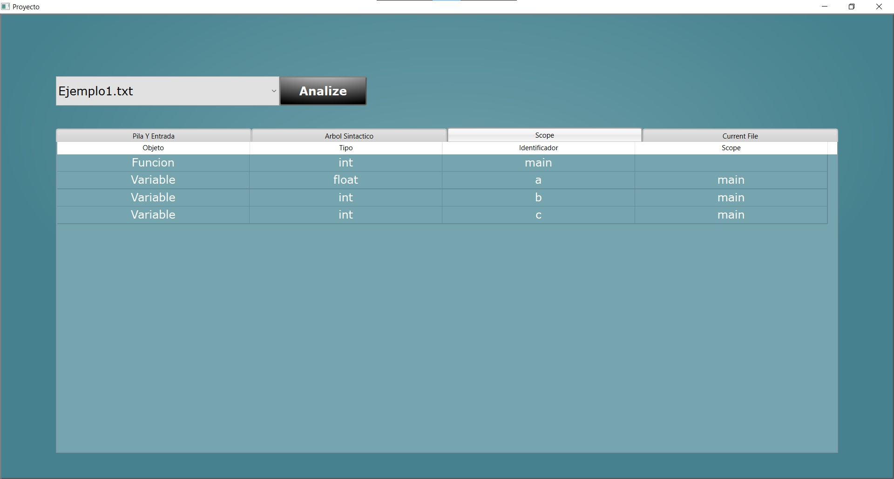
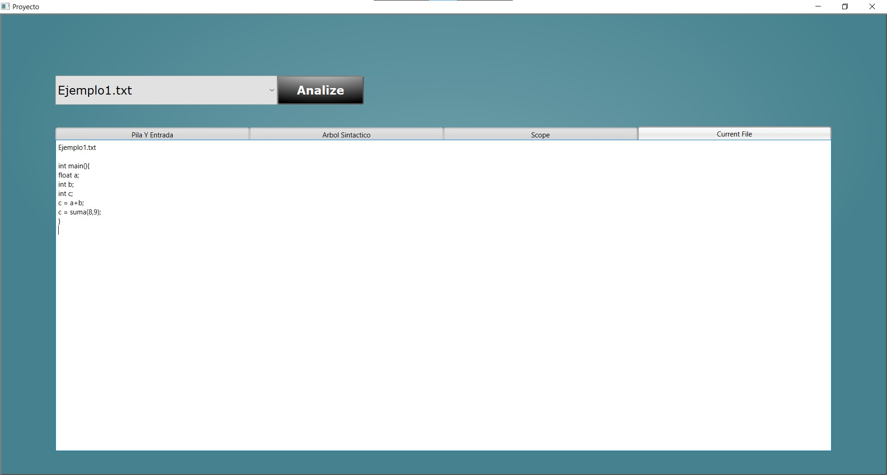

# Proyecto
---
##Analizador Léxico
> [AnalizadorLexico.py](https://github.com/Anexo0/Sem_Traductores_De_Lenguajes_ll/blob/main/Proyecto/AnalizadorLexico.py)

El analizador léxico que se utiliza en este proyecto esta en su respectivo archivo .py el cual es el primero en ser utilizado junto el archivo de entrada que seria un .txt

> [Capeta Gramática](https://github.com/Anexo0/Sem_Traductores_De_Lenguajes_ll/tree/main/Proyecto/Gramatica)

Es una clase de python el cual al inicializarse resuelve primero la Gramática, utilizando los siguientes archivos para identificar la gramática:

- Gramática
- RsWords
- Rules
- Tokens

###Gramática
Contiene la tabla de desplazamientos, reducciones y movimientos que son necesarios realizar dependiendo de la posición del Header actual y del token que actualmente contiene, este es utilizado hasta el Analizador Sintáctico

###RsWords
Contiene el listado de Palabras reservadas para la gramática, por ejemplo las palabras while, if, etc.
También comprende palabras reservadas multiples para un solo token que por ejemplo seria Tipo y sus palabras serian, int, float, string, etc.

###Rules
Contiene las reglas a utilizar cuando se realize las reducciones correspondientes en la gramática, este es utilizado hasta el Analizador Sintáctico

###Tokens
Contiene los tokens a generar junto a sus expresiones regulares las cuales se utilizaran para identificar en el proceso de analizar por parte del analizador léxico

###Funcionamiento
El léxico, una vez que resuelve la gramática, se analizara el archivo deseado, guardando por completo la información para procesar, con esto se tendrá un header que identifica la posición actual del texto a procesar, simplemente hasta que se lea por completo el texto

Primero realizara un pre análisis, el cual solo comprende de obtener la primera palabra que se pueda identificar y retornara esta palabra

Con esta palabra pasara a Coincidir el cual con el listado de tokens y sus expresiones regulares que se obtuvieron en la inicialización y las palabras reservadas, para esto primero pasara por las palabras reservadas y después el listado de tokens, si de alguno de esto encuentra una coincidencia pasara a guardar el símbolo y tu token para guardarlo al listado final de tokens

Al finalizar el análisis, cuando se analizo todo el texto, se retorna el listado de tokens con sus respectivos símbolos de los cuales fueron identificados

---

##Analizador Sintáctico

>[AnalizadorSintactico.py](https://github.com/Anexo0/Sem_Traductores_De_Lenguajes_ll/blob/main/Proyecto/AnalizadorSintactico.py)

El analizador sintáctico que se utiliza en este proyecto esta en su respectivo archivo .py el cual se utiliza después del analizador léxico, ya que necesita de los tokens retornado por el léxico

###Objetos
Para el funcionamiento del analizador sintáctico se implemento dos objetos esenciales:
- Terminales
- No Terminales

Con estos se realiza el análisis y su respectivo árbol sintáctico al final del análisis al estar estos dos objetos vinculados al momento de reducciones para identificar padre e hijo de los cuales serian los componentes de la reducción, conteniendo datos importantes del análisis como símbolo, ámbito, token y estado del que fue procesado en la gramática

###Funcionamiento
El Sintáctico, con la entrada del listado de tokens y previamente inicializado con la gramática y reglas que se utilizaran, generara una pila y una entrada, junto otras variables para mostrar el resultado en la interfaz.

Este analizara cada token en la lista y solo terminara hasta que analice cada token o hasta encontrar una inconsistencia con la gramática con el token actual.

Primero con el token actual y posición del header actual determinara si existe un paso a realizar que indique la gramática para esto obtiene la columna del token y después el paso en la fila correspondiente al header, en caso de ser 0 esto indica un error pero la norma es un desplazamiento (d00) o una reducción (r00)

>**Desplazamiento**
Al detectarse un desplazamiento se mete a la pila el token actual y continua con el siguiente, ademas de mover el header a la posición que indique el desplazamiento 

>**Reducción**
Al detectarse una reducción se obtiene la regla correspondiente a la reducción y se analiza si la reducción se puede realizar con los tokens que están en la pila de ser asi estos se sacan de la pila para poder realizar la reducción y en su lugar se deja el producto de la reducción, en el caso de no poder realizarse la reducción se retorna indicando que hubo un error.
Al terminar la reducción se regresa el header a la posición del ultimo dentro de la pila previo a ingresar el producto de la 
reducción

Al terminar con el análisis se retorna los datos a mostrar para la interfaz gráfica y el ultimo nodo generado que servirá para el árbol sintáctico

Con el ultimo nodo generado se obtiene los nodos finales que serán utilizados para la generación del árbol sintáctico este con una función que esta implementado en dentro del objeto No Terminal

##Analizador Semántico

>[AnalizadorSemantico.py]()

El analizador semántico que se utiliza en este proyecto esta en su respectivo archivo .py el cual se utiliza después del analizador sintáctico, ya que necesita de los Nodos retornado por el sintáctico

###Funcionamiento
El Semántico, con los nodos retornado por el analizador sintáctico pasara por ellos en la manera que se recorre el árbol sintáctico para identificar definiciones como de variables o funciones, ademas identificara sus datos como el tipo de objeto, token, símbolo y ámbito dentro del código

Esto lo hace de manera recursiva hasta que haya analizado todos los nodos

##Interfaz Gráfica

>[Proyecto.py](https://github.com/Anexo0/Sem_Traductores_De_Lenguajes_ll/blob/main/Proyecto/Proyecto.py)

La Interfaz Gráfica que se utiliza en este proyecto esta en su respectivo archivo .py, contiene todos los aspectos gráficos y funcionamientos para interacciones entre el usuario y el programa.

Se compone de la ventana principal del programa con sus diferentes apartados para mostrar los resultados del análisis del archivo de entrada

###Funcionamiento

Al iniciar el programa se identificara todos los archivos .txt que se encuentren en el mismo directorio que el programa, estos los mostrara listados en el Componente que se encuentra en el lado superior izquierda a un lado del botón Analiza al dar clic a este mostrara el listado de archivos que se podrían utilizar como entrada

Con el boton Analize se empieza el analisis del archivo, el archivo que se tiene seleccionado actualmente se puede mostrar en el Tab de Current File

Debajo de estos se puede identificar un Tab Bar que contiene 4 diferentes apartados
La interfaz comprende de 4 apartados para mostrar los resultados del análisis:

- Pila y Entrada
- Árbol Sintáctico
- Scope
- Current File

###Pila y Entrada

En el proceso de usarse el analizador sintáctico se muestra como el proceso del análisis fue hecho, si se realizo algún movimiento, desplazamiento o reducción, incluso si se detecta un error terminaría de mostrar los pasos hasta el error que se encontró para identificar que, dentro de la entrada fue que provoco el error

###Árbol Sintáctico

Aquí se compone unicamente del árbol sintáctico generado al analizar el archivo de entrada, por lo que solo muestra la imagen que se genera

Al utilizar el programa se genera el archivo Graph.png del árbol sintáctico generado

|Imagen Generado    |
|-------------------|
||

###Scope

Con el analizador semántico se retorno las definiciones dentro del código junto con los diferentes datos de estos, como se puede ver se identifica el tipo de objeto, su token, el identificador y su ámbito 

###Current File

Aquí solo se muestra el texto del archivo que se escogió en el listado que esta a un lado del botón de Analiza

